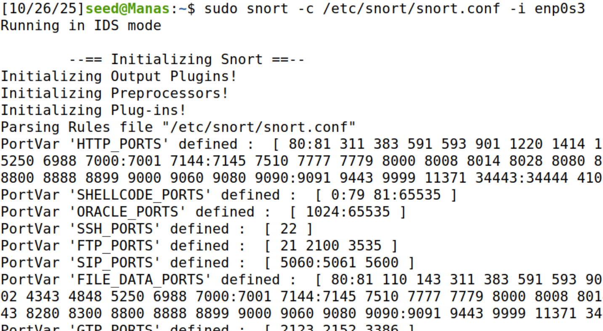

# Exploring Snort (Intrusion Detection and Prevention System)

This lab focuses on installing, configuring, and running **Snort** on Ubuntu to understand the fundamentals of an **Intrusion Detection and Prevention System (IDPS)**.  
Snort monitors network packets, matches them against defined rules, and alerts when suspicious activity is detected.

---

## Step 1 – Update the System

```bash
sudo apt update
sudo apt upgrade -y
```
**Screenshot:**
  
**Explanation:**  
Updating ensures your package lists, dependencies, and security patches are current, reducing vulnerabilities before installing Snort.

---

##  Step 2 – Install Snort

```bash
sudo apt install snort -y
```
**Screenshot:**
  
**Explanation:**  
This installs Snort and its default configs under `/etc/snort/`.

---

##  Step 3 – Configure Snort

Open the configuration file:

```bash
sudo nano /etc/snort/snort.conf
```
**Screenshot:**
 
**Explanation:**  
`HOME_NET` defines your protected network. Matching this to your VM’s range ensures Snort analyzes relevant traffic.

---

##  Step 4 – Update and Manage Rules

### (a) Download community rules (No need for me)
```bash
sudo wget https://www.snort.org/downloads/community/community-rules.tar.gz
sudo tar -xvzf community-rules.tar.gz
sudo cp community-rules/* /etc/snort/rules/
```

### (b) Add a custom rule (No need for me)
```bash
sudo nano /etc/snort/rules/local.rules
```
Insert:
```bash
alert icmp any any -> any any (msg:"ICMP detected"; sid:1000001; rev:1;)
```
  
**Explanation:**  
Rules define how Snort detects malicious behavior.  
This rule triggers an alert whenever ICMP traffic (ping) is seen.

**Answer:**  
Rules act as the *signature definitions* that tell Snort **what to look for and how to respond**, forming the detection logic of the IDS engine.

---

##  Step 5 – Test Configuration

```bash
sudo snort -T -c /etc/snort/snort.conf
```

Expected message:
```
Snort successfully validated the configuration!
```
**Screenshot:**
  
**Explanation:**  
`-T` performs a dry-run syntax check to ensure the configuration and rule files are valid.

---

##  Step 6 – Run Snort in IDS Mode

```bash
sudo snort -c /etc/snort/snort.conf -i enp0s3
``` 
**Screenshot:**
  
**Explanation:**  
This runs Snort in **Intrusion Detection System** mode, reading traffic on the interface and alerting when rules match.  
Press **Ctrl + C** to stop.

---

##  Step 7 – View Snort Logs

Logs are saved in:
```
/var/log/snort/
```

List them:
```bash
ls -lh /var/log/snort/
```
**Screenshot:**
  
**Answer:**  
total 0 → there is no data in the log directory (the files are empty).
-rw------- → the file is readable and writable only by root.
snort.log → Snort created a log file, but it’s size 0 bytes, meaning nothing was recorded: no rule-triggering events occurred yet.

---

##  Step 8 – Run Snort as a Daemon (Background Process)

Start Snort in the background:
```bash
sudo snort -D -c /etc/snort/snort.conf -i enp0s3
```
**Screenshot:**


**Answer**
To stop Snort:

1. Find its PID: ps aux | grep snort

2. Terminate it: sudo kill PID

Explanation:
Running as a daemon allows continuous monitoring even after you log out.


