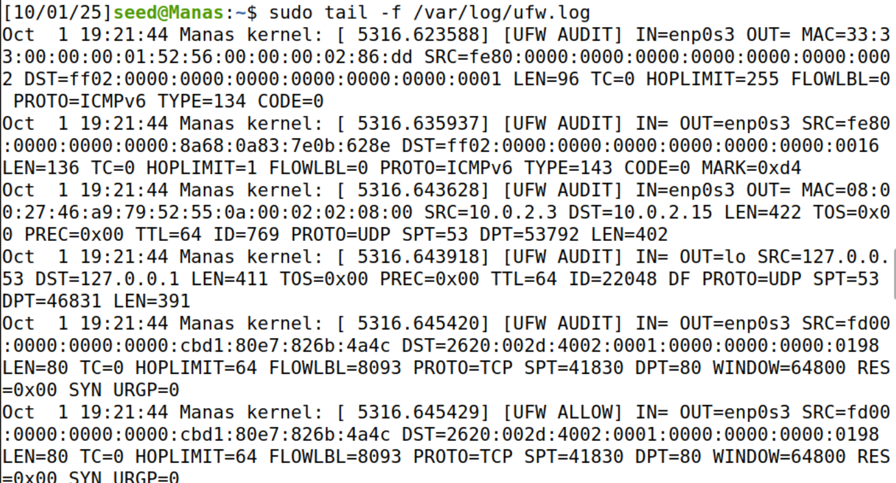

# Exploring UFW Firewall on Ubuntu (Assignment 5)

This lab walks through enabling and managing the **UFW (Uncomplicated Firewall)** on Ubuntu.  
For each step: **run the command → observe output → take a screenshot → write what you learned.**  
Replace the image placeholders with your actual screenshots saved in `screenshots/`.

> Tip: If any command says “command not found”, install the package first with:
> ```bash
> sudo apt update
> sudo apt install <package-name> -y
> ```

---


## I. Enable UFW (Uncomplicated Firewall) )

**UFW Default Policies**
- Incoming: **Denied** by default (block unknown inbound)
- Outgoing: **Allowed** by default

### 1) Check current UFW status
```bash
sudo ufw status
```
**Screenshot:**   

---

### 2) Allow SSH **before** enabling the firewall
```bash
sudo ufw allow 22/tcp
```
**Question:** *If you are remotely accessing your server, why is it important to allow traffic through port 22 before enabling UFW?*  
**Answer:** When we enable UFW, the default rule is to deny all incoming traffic unless we explicitly allow it. If we are connecting to the server remotely over SSH, that connection also uses an incoming port: port 22.

If we don’t allow port 22 before enabling UFW:

1. The firewall will immediately block SSH traffic.

2. We will get disconnected and won’t be able to log back in remotely.

**Screenshot:**   

---

### 3) Check listening ports & services
```bash
sudo ss -tuln
```
- If you see a port you don’t recognize, identify the service behind it:
```bash
sudo lsof -i :<PORT_NUMBER>
```
**Screenshot:**   
**Screenshot (optional lsof example):**   

---

### 4) Enable UFW
```bash
sudo ufw enable
```
**Screenshot:**   

---

### 5) Verify status after enabling
```bash
sudo ufw status
```
**Screenshot:**   

---

### 6) Web server scenario — allow required ports
If this VM runs a web server, allow **HTTP** and **HTTPS**:
```bash
sudo ufw allow 80/tcp      # HTTP
sudo ufw allow 443/tcp     # HTTPS
```
**Question:** *Which ports should be allowed for a typical web server?*  
**Answer:** 80 & 443

**Screenshot:** 

---

### 7) View verbose status
```bash
sudo ufw status verbose
```
**Screenshot:** 

---

### 8) Block a malicious IP (ex-employee at 10.0.0.0)
```bash
sudo ufw deny from 10.0.0.0
```
**Screenshot:** 

---

### 9) Allow a specific IP to port 587
```bash
sudo ufw allow from 192.168.1.50 to any port 587
```
**Question:** *What is port 587 typically used for?*  
**Answer:** Port 587 is the standard port for email submission using the SMTP (Simple Mail Transfer Protocol).

**Screenshot:** 

---

### 10) Re-check rules
```bash
sudo ufw status numbered
```
**Screenshot:**   


---

## II. Enable and Explore UFW Logging

### 1) Turn logging on
```bash
sudo ufw logging on
```
**Screenshot:**   


---

### 2) Set logging level to **high**
Levels: `low`, `medium`, `high`, `full`
```bash
sudo ufw logging high
```
**Screenshot:**   


---

### 3) Understand a UFW log entry
Example:
```
Oct 1 12:34:56 hostname kernel: [12345.67890] [UFW BLOCK] IN=eth0 OUT= MAC=aa:bb:cc:dd:ee:ff SRC=192.168.1.100 DST=192.168.1.50 LEN=60 TOS=0x00 PREC=0x00 TTL=64 ID=54321 DF PROTO=TCP SPT=12345 DPT=80 WINDOW=14600 RES=0x00 SYN URGP=0
```
**Key fields you should annotate in your words:**
- **MAC** – Source MAC address  
- **SRC/DST** – Source/Destination IPs  
- **SPT/DPT** – Source/Destination Ports  
- **PROTO** – Protocol (TCP/UDP)  
- **[UFW BLOCK]** – Action taken by UFW  

**Question:** *Why is this information useful to us?*  
**Answer:** This information is useful because it shows who sent the traffic, where it was going, what type of connection it was, and that UFW blocked it. These details help confirm that firewall rules are working correctly, detect suspicious activity, and provide evidence for incident response.

---

### 4) Watch logs in real time
```bash
sudo tail -f /var/log/ufw.log
```
**Screenshot:** 


---

### 5) Filter logs with grep
Denied traffic:
```bash
sudo grep 'DENY' /var/log/ufw.log
```
Allowed traffic:
```bash
sudo grep 'ALLOW' /var/log/ufw.log
```
**Screenshot (DENY/ALLOW):**  

**Question:** *Is there any output for DENY? Why or why not?*  
**Answer:** No UFW BLOCK (DENY) entries were observed, because no blocked traffic has occurred yet. This is expected since the VM isn’t being scanned or attacked.

---

## 🔧 Troubleshooting & Tips

- **“ufw: command not found”** → Install it:
  ```bash
  sudo apt update && sudo apt install ufw -y
  ```
- **Locked yourself out (SSH) after enable?**  
  Use VM console to run:
  ```bash
  sudo ufw allow 22/tcp
  sudo ufw reload
  ```
- **Remove a rule by number (from `status numbered`):**
  ```bash
  sudo ufw status numbered
  sudo ufw delete <RULE_NUMBER>
  ```
- **Reset UFW completely (careful):**
  ```bash
  sudo ufw reset
  sudo ufw disable
  ```

---

## ✅ Submission Checklist

- [ ] All steps executed and **screenshots** saved into `screenshots/`
- [ ] Questions answered in your own words
- [ ] Commit and push to GitHub:
  ```bash
  git add .
  git commit -m "Assignment 5: UFW firewall configuration and logging"
  git push
  ```
- [ ] Submit your repo link

---

## 🧠 Reflection (2–4 sentences)

What did you learn about default-deny firewalls, service scoping (by port and source IP), and reading logs for security signals? How would you harden a real server beyond this lab?
