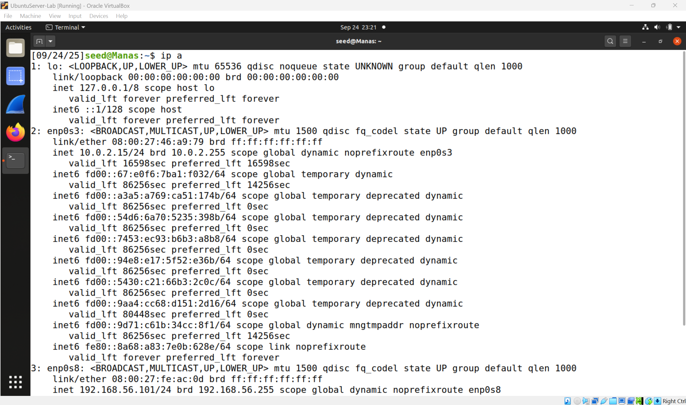
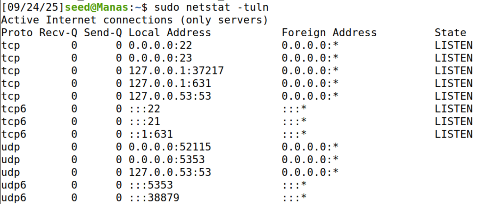
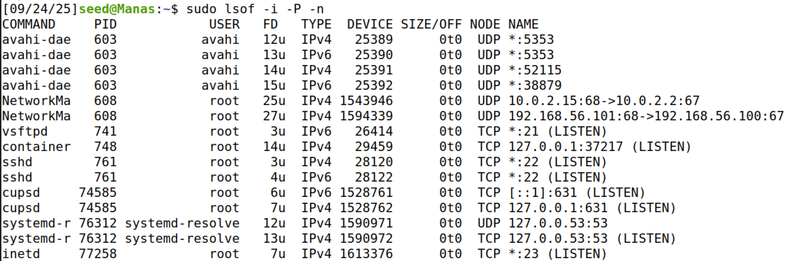
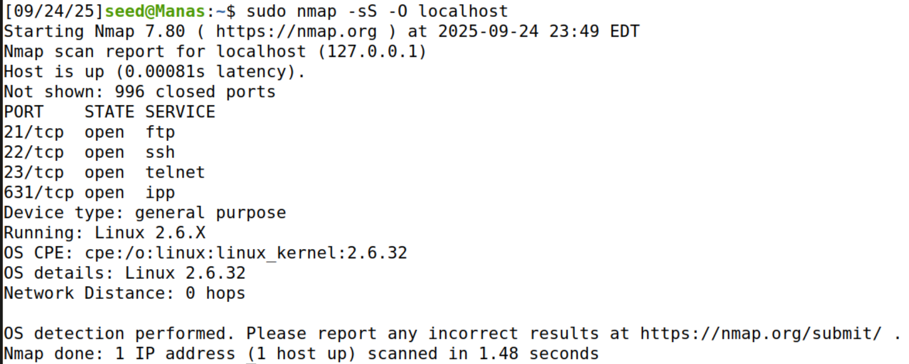
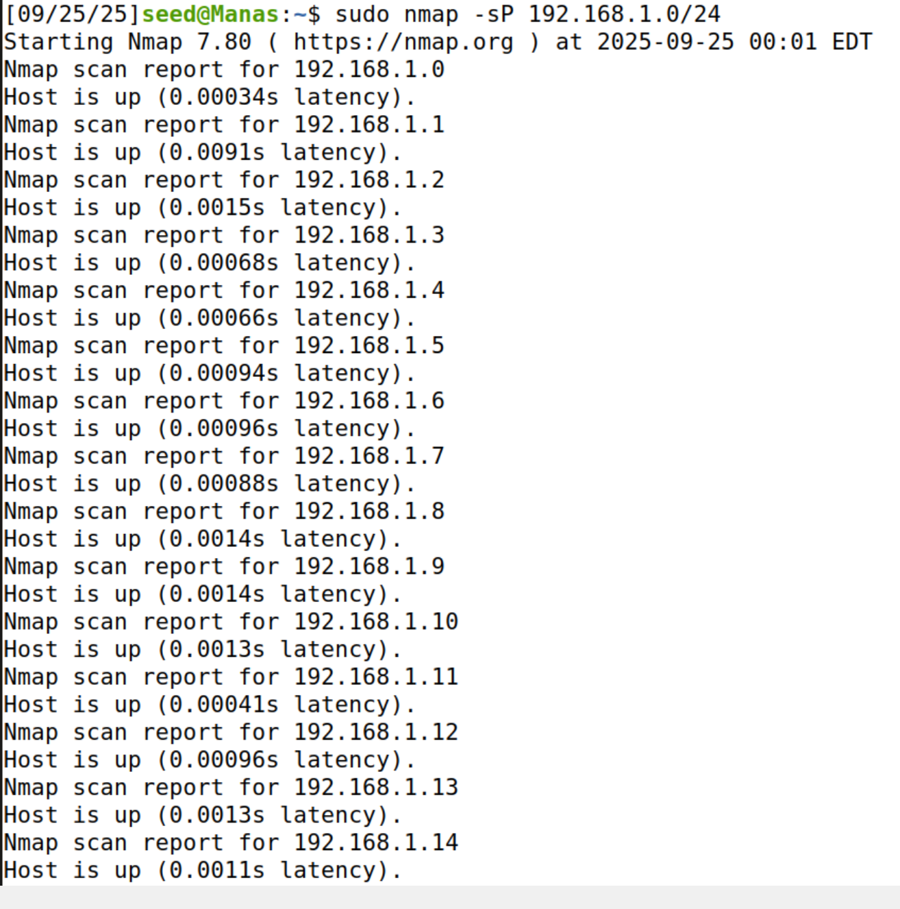
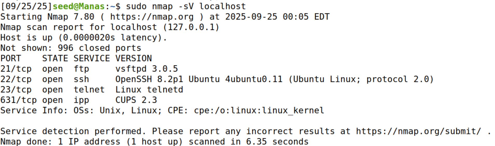
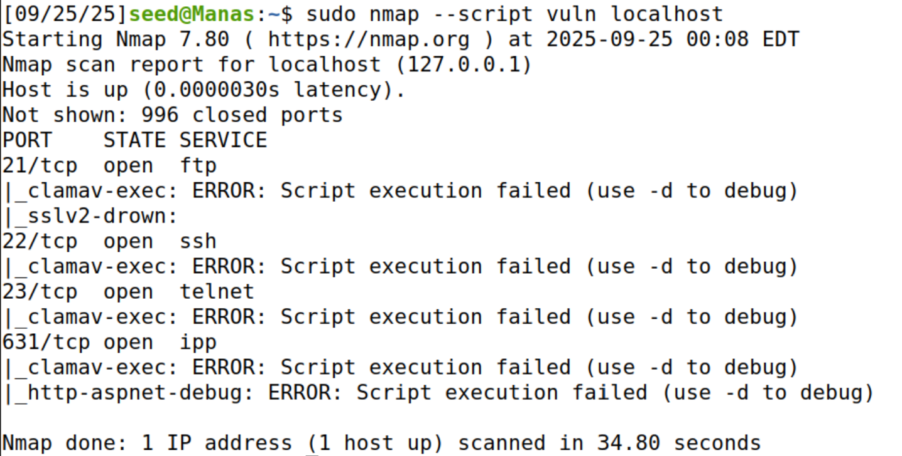
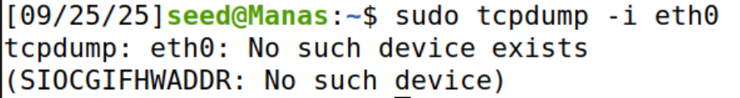
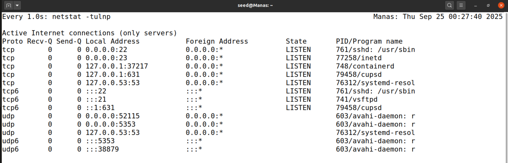
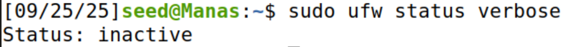

# Exploring Ubuntu Home Lab

This lab explores network security basics by inspecting my Ubuntu server’s configuration, network activity, and potential vulnerabilities. Each step includes the command, explanation, and screenshot evidence.  

---

## 1. Identify Network Interfaces and IP Addresses
**Command:**
```bash
ip a
# or
ifconfig
```
**Explanation:**  
These commands display all network interfaces and their associated IP addresses. This helps confirm which interfaces are active (e.g., `eth0`, `lo`) and their IPs.  

**Screenshot:**  


---

## 2. Check Open Ports
**Command:**
```bash
sudo netstat -tuln
# or
ss -tuln
```
**Explanation:**  
Shows open TCP/UDP ports and listening services. This reveals potential entry points for attackers.  

**Screenshot:**  


---

## 3. Analyze Network Connections
**Command:**
```bash
sudo lsof -i -P -n
```
**Explanation:**  
Lists active connections and the processes behind them. Useful to spot unauthorized traffic.  

**Screenshot:**  


---

## 4. Perform Network Scanning with Nmap
**Command:**
```bash
sudo nmap -sS -O localhost
```
**Explanation:**  
Performs a stealth SYN scan and tries to detect the OS. Helps identify open services and OS fingerprinting.  

**Screenshot:**  


---

## 5. Scan Local Network for Hosts
**Command:**
```bash
sudo nmap -sP 192.168.1.0/24
```
**Explanation:**  
Discovers all live devices in the local network. Helps detect unauthorized or hidden hosts.  

**Screenshot:**  


---

## 6. Check Services and Versions
**Command:**
```bash
sudo nmap -sV localhost
```
**Explanation:**  
Detects the version of each running service. Outdated versions may expose vulnerabilities.  

**Screenshot:**  


---

## 7. Identify Potential Vulnerabilities
**Command:**
```bash
sudo nmap --script vuln localhost
```
**Explanation:**  
Runs vulnerability detection scripts. This identifies known vulnerabilities in installed services.  

**Screenshot:**  


---

## 8. Inspect Network Traffic
**Command:**
```bash
sudo tcpdump -i eth0
```
**Explanation:**  
Captures live packets on the selected interface. Useful for analyzing suspicious traffic. But, my VM doesnot have a network interface named eth0.  

**Screenshot:**  


---

## 9. Monitor Network Connections in Real-Time
**Command:**
```bash
sudo watch -n 1 netstat -tulnp
```
**Explanation:**  
Refreshes every second to show live network activity and new connections.  

**Screenshot:**  


---

## 10. Check Firewall Rules
**Command:**
```bash
sudo ufw status verbose
```
**Explanation:**  
Displays firewall configuration. Ensures only necessary ports are open. My firewall is inactive.

**Screenshot:**  


---

## Summary
In this lab, I have:  
- Identified network interfaces & IPs  
- Checked open ports and active connections  
- Scanned my system and local network with Nmap  
- Captured live traffic with tcpdump  
- Verified firewall status  

This process helped me better understand my server’s network environment and security posture.
